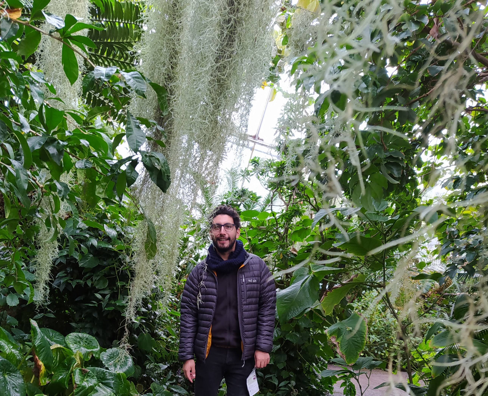

Updated : 7th June.

Taking inspiration from my current read, "The Art of Learning", I've embarked on a series of personal experiments. I'm pushing my boundaries, confronting challenges, and seeking a deeper understanding of myself and how I interact with the world around me. Each experiment is a step forward (or backwards) to self-improvement, a chance to grow and become more aware of my limits.
A non ordered (or complete) list of experiments:
- join a random class in the gym
- play table tennis only using my backhand
- cooking something new!
- taking a longer route to home
- following some Dr. Hubberman advice: 20 minutes aerobic exercise, no phone in the morning-night, glass of water to start the day.
- journal daily (it has worked yet)
- try new food

Away from the screen, I'm getting to grips with life in the UK. Even though I've been here for a while, there's always something new to discover. There is different way to approach nature, which expresses for example in lots of home gardens and lovely botanical gardens.

I practice table tennis on Wednesdays and Fridays in the Community club. The physical part is always evolving as I discover new players with intricate strategies. In England compared to Chile, I find intriguing that a lot of people drills are excellent but lose easily in the games. I think people in Chile tend to hide their abilities to surprise in the game.

***
Keep an eye on this page for updates on what I'm up to. As my story continues to unfold, I'm excited to share it with you.

If you've got any questions, ideas, or just fancy a chat, don't hesitate to get in touch.

***
